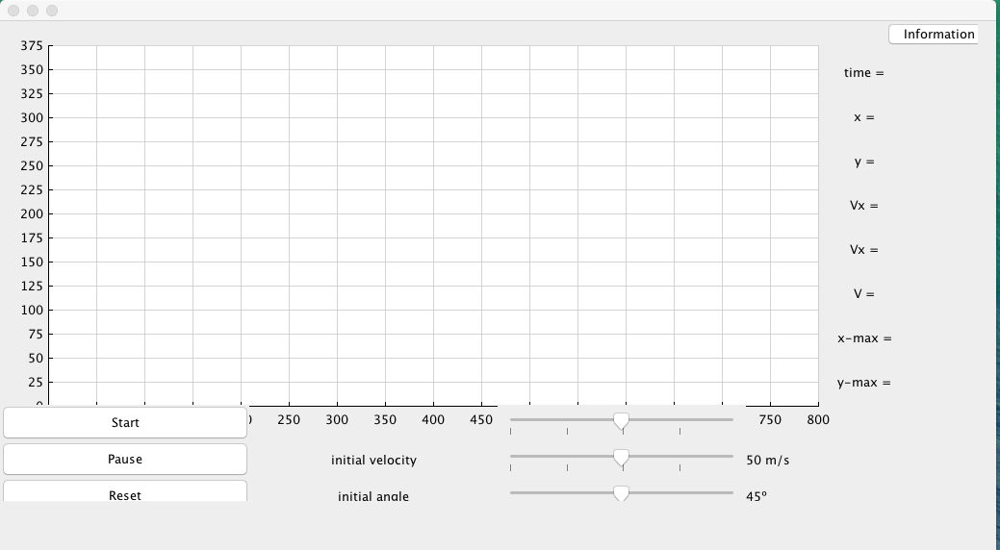

# Projectile SImulator

This projectile simulator, is used to determine the velocity and positiion of a projectile throwed
in a certain position. If you want to read further information, check (In Spanish) [Guion](report/guion.pdf)

In this project I implemented a graphical interface.



## Getting Started

In this section I will explain how to run and build the program.

### Prerequisites

You need to install the `ant` dependencies manager.

In **macOS** you can install `ant` by running.

```
brew install ant
```

### Installing

After having `ant` installed you can run the command:

``` 
ant
```
So it is going to generate the binary files under `bin/`.

## Authors

* **Cristian Abrante Dorta** - [CristianAbrante](https://github.com/CristianAbrante)

## License

This project is licensed under the MIT License - see the [LICENSE](LICENSE) file for details
